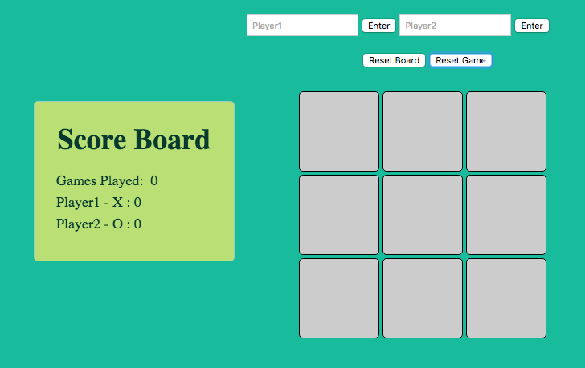
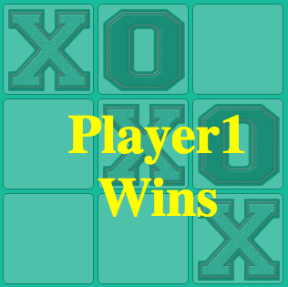
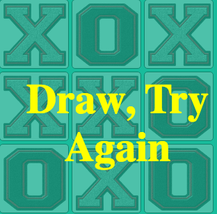

# Project 0 - Tic Tac Toe

Tic Tac Toe is a two player game that by default uses Knots and Crosses to represent a player's token.

This project is fully built with HTML, CSS and Javascript.

Player1 in this instance is always knots (and always starts) and Player2 is always Crosses.

The game allows for changing of names for players if they do not prefer to just be known as player one or player 2.

This game also keeps track of the number of games played and how many games each player has won.

There are two buttons to reset the game.
* Reset Board - resets just the board tokens but not the scores.
* Reset Game - resets the scores and the board

[Play TicTacToe](https://lsamon.github.io/tictactoe)

Out of Scope:
* The AI functionality is not included.
* Game is not very mobile friendly. some features are missing.

## Default Game View

## Example win Scenario

## Example draw Scenario

### Issue Reporting
if you find any bugs please contact me at louis.amon@amazutech.net
